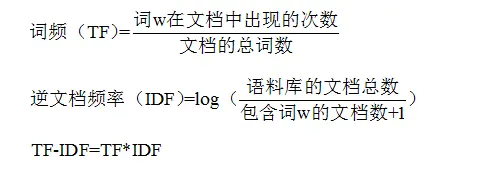

# 利用Python实现中文文本关键词抽取的三种方法

>文本关键词抽取，是对文本信息进行高度凝练的一种有效手段，通过3-5个词语准确概括文本的主题，帮助读者快速理解文本信息。目前，用于文本关键词提取的主要方法有四种：基于TF-IDF的关键词抽取、基于TextRank的关键词抽取、基于Word2Vec词聚类的关键词抽取，以及多种算法相融合的关键词抽取。笔者在使用前三种算法进行关键词抽取的学习过程中，发现采用TF-IDF和TextRank方法进行关键词抽取在网上有很多的例子，代码和步骤也比较简单，但是采用Word2Vec词聚类方法时网上的资料并未把过程和步骤表达的很清晰。因此，本文分别采用TF-IDF方法、TextRank方法和Word2Vec词聚类方法实现对专利文本（同样适用于其它类型文本）的关键词抽取，通过理论与实践相结合的方式，一步步了解、学习、实现中文文本关键词抽取。

# 1 概述

  一篇文档的关键词等同于最能表达文档主旨的N个词语，即对于文档来说最重要的词，因此，可以将文本关键词抽取问题转化为词语重要性排序问题，选取排名前TopN个词语作为文本关键词。目前，主流的文本关键词抽取方法主要有以下两大类：

#### （1）基于统计的关键词提取方法

  该方法根据统计信息，如词频，来计算得到文档中词语的权重，按权重值排序提取关键词。TF-IDF和TextRank均属于此类方法，其中TF-IDF方法通过计算单文本词频（Term Frequency， TF）和逆文本频率指数（Inverse Document Frequency， IDF）得到词语权重；TextRank方法基于PageRank的思想，通过词语共现窗口构建共现网络，计算词语得分。此类方法简单易行，适用性较强，然而未考虑词序问题。

#### （2）基于机器学习的关键词提取方法

该方法包括了SVM、朴素贝叶斯等有监督学习方法，以及K-means、层次聚类等无监督学习方法。在此类方法中，模型的好坏取决于特征提取，而深度学习正是特征提取的一种有效方式。由Google推出的Word2Vec词向量模型，是自然语言领域中具有代表性的学习工具。它在训练语言模型的过程中将词典映射到一个更抽象的向量空间中，每一个词语通过高维向量表示，该向量空间中两点之间的距离就对应两个词语的相似程度。

基于以上研究，本文分别采用**TF-IDF方法、TextRank方法和Word2Vec词聚类方法**，利用Python语言进行开发，实现文本关键词的抽取。

# 2 开发环境准备

## 2.1 Python环境

笔者使用的是anaconda环境下的Python 3.10.13。

## 2.2 第三方模块

  本实验实现使用的主要模块如下所示：

##### （1）Jieba

  目前使用最为广泛的中文分词组件。
##### （2）Gensim

  用于主题模型、文档索引和大型语料相似度索引的python库，主要用于自然语言处理（NLP）和信息检索（IR）。 本实例中的维基中文语料处理和中文词向量模型构建需要用到该模块。

##### （3）Pandas

  用于高效处理大型数据集、执行数据分析任务的python库，是基于Numpy的工具包。安装方法：pip install pandas。

##### （4）Numpy

  用于存储和处理大型矩阵的工具包。

##### （5）Scikit-learn

  用于机器学习的python工具包，python模块引用名字为sklearn，安装前还需要Numpy和Scipy两个Python库。本实例中主要用到了该模块中的feature_extraction、KMeans（k-means聚类算法）和PCA（pac降维算法）。

##### （6）Matplotlib

 Matplotlib是一个python的图形框架，用于绘制二维图形。

# 3 数据准备

## 3.1 样本语料
文本将汽车行业的10篇专利作为样本数据集，见文件“data/sample_data.csv”。文件中依顺序包含编号（id）、标题（title）和摘要（abstract）三个字段，其中标题和摘要都要参与到关键词的抽取。各位可根据自己的样本数据进行数据读取相关代码的调整。

## 3.2 停用词词典

本文使用中科院计算所中文自然语言处理开放平台发布的中文停用词表，包含了1208个停用词。下载地址：[http://www.hicode.cc/download/view-software-13784.html](http://www.hicode.cc/download/view-software-13784.html)

另外，由于本实例的样本是专利文本，词汇专业性较高，需要人工新增停用词，可直接在上述停用词表中添加，一行为一个停用词，见文件“data/stopWord.txt”。在本例中，笔者在文件最前面人工新增了“包括、相对、免受、用于、本发明、结合”这六个停用词，用于示范，各位可根据实际情况自行删减或新增停用词。

# 4 基于TF-IDF的文本关键词抽取方法

## 4.1 TF-IDF算法思想

词频（Term Frequency，TF）指某一给定词语在当前文件中出现的频率。由于同一个词语在长文件中可能比短文件有更高的词频，因此根据文件的长度，需要对给定词语进行归一化，即用给定词语的次数除以当前文件的总词数。

逆向文件频率（Inverse Document Frequency，IDF）是一个词语普遍重要性的度量。即如果一个词语只在很少的文件中出现，表示更能代表文件的主旨，它的权重也就越大；如果一个词在大量文件中都出现，表示不清楚代表什么内容，它的权重就应该小。

TF-IDF的主要思想是，如果某个词语在一篇文章中出现的频率高，并且在其他文章中较少出现，则认为该词语能较好的代表当前文章的含义。即一个词语的重要性与它在文档中出现的次数成正比，与它在语料库中文档出现的频率成反比。

计算公式如下：

## 4.2 TF-IDF文本关键词抽取方法流程

  由以上可知，TF-IDF是对文本所有候选关键词进行加权处理，根据权值对关键词进行排序。假设Dn为测试语料的大小，该算法的关键词抽取步骤如下所示：

（1） 对于给定的文本D进行分词、词性标注和去除停用词等数据预处理操作。本文采用jieba分词，保留'n','nz','v','vd','vn','l','a','d'这几个词性的词语('n': 名词,'nz': 其他专有名词,'v': 动词,'vd': 副动词,'vn': 名动词,'l': 习用语,'a': 形容词,'d': 副词)，最终得到n个候选关键词，即D=[t1,t2,…,tn]  ；

（2） 计算词语ti 在文本D中的词频；

（3） 计算词语ti 在整个语料的IDF=log (Dn /(Dt +1))，Dt 为语料库中词语ti 出现的文档个数；

（4） 计算得到词语ti 的TF-IDF=TF*IDF，并重复（2）—（4）得到所有候选关键词的TF-IDF数值；

（5） 对候选关键词计算结果进行倒序排列，得到排名前TopN个词汇作为文本关键词。

## 4.3 代码实现

 Python第三方工具包Scikit-learn提供了TFIDF算法的相关函数，本文主要用到了sklearn.feature_extraction.text下的TfidfTransformer和CountVectorizer函数。其中，CountVectorizer函数用来构建语料库的中的词频矩阵，TfidfTransformer函数用来计算词语的tfidf权值。

注：TfidfTransformer()函数有一个参数smooth_idf，默认值是True，若设置为False，则IDF的计算公式为idf=log(Dn /Dt ) + 1。

基于TF-IDF方法实现文本关键词抽取的代码执行步骤如下：

（1）读取样本源文件sample_data.csv;

（2）获取每行记录的标题和摘要字段，并拼接这两个字段；

（3）加载自定义停用词表stopWord.txt，并对拼接的文本进行数据预处理操作，包括分词、筛选出符合词性的词语、去停用词，用空格分隔拼接成文本;

（4）遍历文本记录，将预处理完成的文本放入文档集corpus中；

（5）使用CountVectorizer()函数得到词频矩阵，a[j][i]表示第j个词在第i篇文档中的词频；

（6）使用TfidfTransformer()函数计算每个词的tf-idf权值；

（7）得到词袋模型中的关键词以及对应的tf-idf矩阵；

（8）遍历tf-idf矩阵，打印每篇文档的词汇以及对应的权重；

（9）对每篇文档，按照词语权重值降序排列，选取排名前topN个词最为文本关键词，并写入数据框中；

（10）将最终结果写入文件keys_TFIDF.csv中。

最终运行结果如下图所示。

# 5 基于TextRank的文本关键词抽取方法

## 5.1 PageRank算法思想

TextRank算法是基于PageRank算法的，因此，在介绍TextRank前不得不了解一下PageRank算法。

PageRank算法是Google的创始人拉里·佩奇和谢尔盖·布林于1998年在斯坦福大学读研究生期间发明的，是用于根据网页间相互的超链接来计算网页重要性的技术。该算法借鉴了学术界评判学术论文重要性的方法，即查看论文的被引用次数。基于以上想法，PageRank算法的核心思想是，认为网页重要性由两部分组成：

① 如果一个网页被大量其他网页链接到说明这个网页比较重要，即被链接网页的数量；

② 如果一个网页被排名很高的网页链接说明这个网页比较重要，即被链接网页的权重。

一般情况下，一个网页的PageRank值（PR）计算公式如下所示：

其中，PR(Pi)是第i个网页的重要性排名即PR值；ɑ是阻尼系数，一般设置为0.85；N是网页总数；Mpi 是所有对第i个网页有出链的网页集合；L(Pj)是第j 个网页的出链数目。

初始时，假设所有网页的排名都是1/N，根据上述公式计算出每个网页的PR值，在不断迭代趋于平稳的时候，停止迭代运算，得到最终结果。一般来讲，只要10次左右的迭代基本上就收敛了。

## 5.2 TextRank算法思想

TextRank算法是Mihalcea和Tarau于2004年在研究自动摘要提取过程中所提出来的，在PageRank算法的思路上做了改进。该算法把文本拆分成词汇作为网络节点，组成词汇网络图模型，将词语间的相似关系看成是一种推荐或投票关系，使其可以计算每一个词语的重要性。

基于TextRank的文本关键词抽取是利用局部词汇关系，即共现窗口，对候选关键词进行排序，该方法的步骤如下：

（1） 对于给定的文本D进行分词、词性标注和去除停用词等数据预处理操作。本文采用结巴分词，保留'n','nz','v','vd','vn','l','a','d'这几个词性的词语，最终得到n个候选关键词，即D=[t1,t2,…,tn] ；

（2） 构建候选关键词图G=(V,E)，其中V为节点集，由候选关键词组成，并采用共现关系构造任两点之间的边，两个节点之间仅当它们对应的词汇在长度为K的窗口中共现则存在边，K表示窗口大小即最多共现K个词汇；

（3） 根据公式迭代计算各节点的权重，直至收敛；

（4） 对节点权重进行倒序排列，得到排名前TopN个词汇作为文本关键词。

说明：Jieba库中包含jieba.analyse.textrank函数可直接实现TextRank算法，本文采用该函数进行实验。

## 5.3 代码实现

基于TextRank方法实现文本关键词抽取的代码执行步骤如下：

（1）读取样本源文件sample_data.csv;

（2）获取每行记录的标题和摘要字段，并拼接这两个字段；

（3）加载自定义停用词表stopWord.txt;

（4）遍历文本记录，采用jieba.analyse.textrank函数筛选出指定词性，以及topN个文本关键词，并将结果存入数据框中；

（5）将最终结果写入文件keys_TextRank.csv中。

最终运行结果如下图所示。

# 6 基于Word2Vec词聚类的文本关键词抽取方法
## 6.1 Word2Vec词向量表示

众所周知，机器学习模型的输入必须是数值型数据，文本无法直接作为模型的输入，需要首先将其转化成数学形式。基于Word2Vec词聚类方法正是一种机器学习方法，需要将候选关键词进行向量化表示，因此要先构建Word2Vec词向量模型，从而抽取出候选关键词的词向量。

Word2Vec是当时在Google任职的Mikolov等人于2013年发布的一款词向量训练工具，一经发布便在自然语言处理领域得到了广泛的应用。该工具利用浅层神经网络模型自动学习词语在语料库中的出现情况，把词语嵌入到一个高维的空间中，通常在100-500维，在新的高维空间中词语被表示为词向量的形式。与传统的文本表示方式相比，Word2Vec生成的词向量表示，词语之间的语义关系在高维空间中得到了较好的体现，即语义相近的词语在高维空间中的距离更近；同时，使用词向量避免了词语表示的“维度灾难”问题。

就实际操作而言，特征词向量的抽取是基于已经训练好的词向量模型，词向量模型的训练需要海量的语料才能达到较好的效果，而wiki中文语料是公认的大型中文语料，本文拟从wiki中文语料生成的词向量中抽取本文语料的特征词向量。Wiki中文语料的Word2vec模型训练在文章“利用Python实现wiki中文语料的word2vec模型构建”(https://github.com/gmh1627/Wiki_Zh_Word2vec_Python3)中做了详尽的描述，在此不赘述。即本文从文章最后得到的文件“wiki.zh.text.vector”中抽取候选关键词的词向量作为聚类模型的输入。

另外，在阅读资料的过程中发现，有些十分专业或者生僻的词语可能wiki中文语料中并未包含，为了提高语料的质量，可新增实验所需的样本语料一起训练，笔者认为这是一种十分可行的方式。本例中为了简便并未采取这种方法，各位可参考此种方法根据自己的实际情况进行调整。

## 6.2 K-means聚类算法

聚类算法旨在数据中发现数据对象之间的关系，将数据进行分组，使得组内的相似性尽可能的大，组件的相似性尽可能的小。
	
K-Means是一种常见的基于原型的聚类技术，本文选择该算法作为词聚类的方法。其算法思想是：首先随机选择K个点作为初始质心，K为用户指定的所期望的簇的个数，通过计算每个点到各个质心的距离，将每个点指派到最近的质心形成K个簇，然后根据指派到簇的点重新计算每个簇的质心，重复指派和更新质心的操作，直到簇不发生变化或达到最大的迭代次数则停止。

## 6.3 Word2Vec词聚类文本关键词抽取方法流程

 Word2Vec词聚类文本关键词抽取方法的主要思路是对于用词向量表示的文本词语，通过K-Means算法对文章中的词进行聚类，选择聚类中心作为文章的一个主要关键词，计算其他词与聚类中心的距离即相似度，选择topN个距离聚类中心最近的词作为文本关键词，而这个词间相似度可用Word2Vec生成的向量计算得到。

假设Dn为测试语料的大小，使用该方法进行文本关键词抽取的步骤如下所示：

（1） 对Wiki中文语料进行Word2vec模型训练，参考文章“利用Python实现wiki中文语料的word2vec模型构建”(http://www.jianshu.com/p/ec27062bd453) ,得到词向量文件“wiki.zh.text.vector”；

（2） 对于给定的文本D进行分词、词性标注、去重和去除停用词等数据预处理操作。本分采用结巴分词，保留'n','nz','v','vd','vn','l','a','d'这几个词性的词语，最终得到n个候选关键词，即D=[t1,t2,…,tn] ；

（3） 遍历候选关键词，从词向量文件中抽取候选关键词的词向量表示，即WV=[v1，v2，…，vm]；

（4） 对候选关键词进行K-Means聚类，得到各个类别的聚类中心；

（5） 计算各类别下，组内词语与聚类中心的距离（欧几里得距离），按聚类大小进行升序排序；

（6） 对候选关键词计算结果得到排名前TopN个词汇作为文本关键词。

步骤（4）中需要人为给定聚类的个数，本文测试语料是汽车行业的专利文本，因此只需聚为1类，各位可根据自己的数据情况进行调整；步骤（5）中计算各词语与聚类中心的距离，常见的方法有欧式距离和曼哈顿距离，本文采用的是欧式距离，计算公式如下：

## 6.4 代码实现

 Python第三方工具包Scikit-learn提供了K-Means聚类算法的相关函数，本文用到了sklearn.cluster.KMeans()函数执行K-Means算法，sklearn.decomposition.PCA()函数用于数据降维以便绘制图形。

  基于Word2Vec词聚类方法实现文本关键词抽取的代码执行步骤如下：

（1）读取样本源文件sample_data.csv;

（2）获取每行记录的标题和摘要字段，并拼接这两个字段；

（3）加载自定义停用词表stopWord.txt，并对拼接的文本进行数据预处理操作，包括分词、筛选出符合词性的词语、去重、去停用词，形成列表存储；

（4）读取词向量模型文件'wiki.zh.text.vector'，从中抽取出所有候选关键词的词向量表示，存入文件中；

（5）读取文本的词向量表示文件，使用KMeans()函数得到聚类结果以及聚类中心的向量表示；

（6）采用欧式距离计算方法，计算得到每个词语与聚类中心的距离；

（7）按照得到的距离升序排列，选取排名前topN个词作为文本关键词，并写入数据框中；

（8）将最终结果写入文件keys_word2vec.csv中。

  最终运行结果如下图所示。

# 7 结语
	
本文总结了三种常用的抽取文本关键词的方法：TF-IDF、TextRank和Word2Vec词向量聚类，并做了原理、流程以及代码的详细描述。因本文使用的测试语料较为特殊且数量较少，未做相应的结果分析，根据观察可以发现，得到的十个文本关键词都包含有文本的主旨信息，其中TF-IDF和TextRank方法的结果较好，Word2Vec词向量聚类方法的效果不佳，这与文献[8]中的结论是一致的。文献[8]中提到，对单文档直接应用Word2Vec词向量聚类方法时，选择聚类中心作为文本的关键词本身就是不准确的，因此与其距离最近的N个词语也不一定是关键词，因此用这种方法得到的结果效果不佳；而TextRank方法是基于图模型的排序算法，在单文档关键词抽取方面有较为稳定的效果，因此较多的论文是在TextRank的方法上进行改进而提升关键词抽取的准确率。

另外，本文的实验目的主要在于讲解三种方法的思路和流程，实验过程中的某些细节仍然可以改进。例如Word2Vec模型训练的原始语料可加入相应的专业性文本语料；标题文本往往包含文档的重要信息，可对标题文本包含的词语给予一定的初始权重；测试数据集可采集多个分类的长文本，与之对应的聚类算法KMeans()函数中的n_clusters参数就应当设置成分类的个数；根据文档的分词结果，去除掉所有文档中都包含某一出现频次超过指定阈值的词语；等等。各位可根据自己的实际情况或者参考论文资料进行参数的优化以及细节的调整，欢迎给我留言或者私信讨论，大家一起共同学习。

>至此，利用Pyhon实现中文文本关键词抽取的三种方法全部介绍完毕，测试数据、代码和运行结果已上传至[本人的GitHub仓库](https://github.com/gmh1627/Keyword-Extraction-Python3/)。项目文件为keyword_extraction，data文件夹中包含停用词表stopWord.txt和测试集sample_data.csv，result文件夹包含三种方法的实验结果和每篇文档对应的词向量文件（vecs）。文中若存在不正确的地方，欢迎各位朋友批评指正！

#### 参考文献：

[1] [http://www.ruanyifeng.com/blog/2013/03/tf-idf.html](http://www.ruanyifeng.com/blog/2013/03/tf-idf.html)

[2] http://www.cnblogs.com/biyeymyhjob/archive/2012/07/17/2595249.html

[3] [https://yq.aliyun.com/articles/69934](https://yq.aliyun.com/articles/69934)

[4] [https://www.cnblogs.com/rubinorth/p/5799848.html](https://www.cnblogs.com/rubinorth/p/5799848.html)

[5]余珊珊, 苏锦钿, 李鹏飞. 基于改进的TextRank的自动摘要提取方法[J]. 计算机科学, 2016, 43(6):240-247.

[6] [http://www.doc88.com/p-8955287687257.html](http://www.doc88.com/p-8955287687257.html)

[7] [http://www.doc88.com/p-4711540891452.html](http://www.doc88.com/p-4711540891452.html)

[8] 夏天. 词向量聚类加权TextRank的关键词抽取[J]. 现代图书情报技术, 2017, 1(2):28-34.
